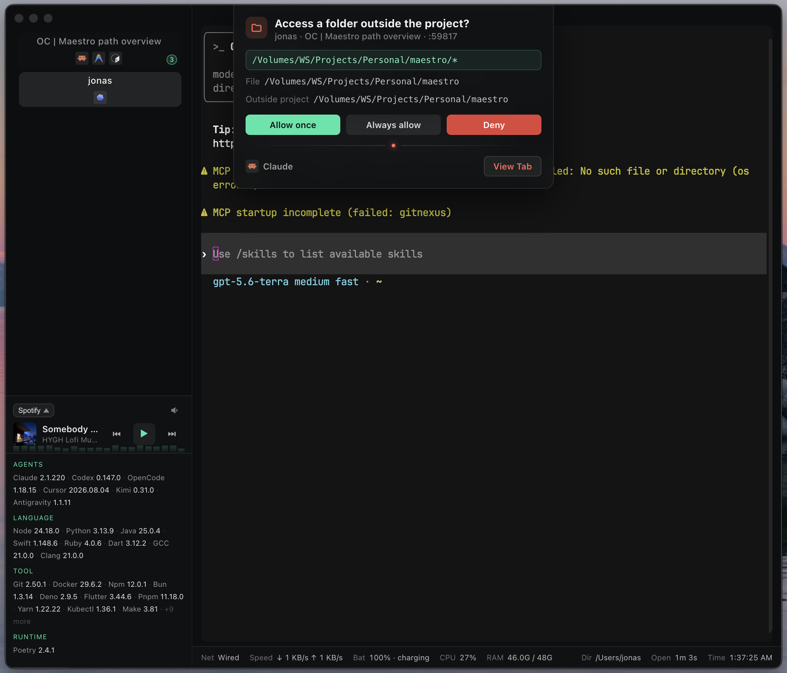

<p align="center">
  
</p>

<p align="center">
  <b>HYPER-KIT</b> · arcade power-up cartridge for <a href="https://hyper.is">HYPER TERMINAL</a>
</p>

<p align="center">
  <code>INSERT COIN</code> · <code>VERTICAL TABS</code> · <code>NEON ACCENTS</code> · <code>NOW PLAYING</code>
</p>

<br>

<p align="center">
  
</p>

---

## ▚ WHAT IS IT

One cartridge. No plugin soup. Turns Hyper into a vertical arcade HUD — every module toggles from one config block.

## ▚ FEATURES

- **VERTICAL TABS** — dual-row HUD, live cwd (OSC 7), agent icons, pane-count badges, drag & drop reorder, resizable dock
- **CLOSE GUARD** — confirms before closing a tab/window still running a command (native dialog)
- **INVENTORY PANEL** — probes 87 tools, agents, runtimes & languages
- **STATUS PANEL** — Wi-Fi, throughput, battery, CPU, RAM, dir, clock
- **EXPLORER** — whole-disk folder tree from the status panel, opens a new tab at any folder, pin to bookmark
- **BOOKMARKS** — pinned folders as a grid, one click opens a new tab there
- **NOW PLAYING** — pick any playing app: cover, transport, volume slider (browser tabs too)
- **AGENT MONITOR** — popup cards for opencode permission requests; per-agent on/off, scoped to this Hyper window by default (mDNS + port scan)

## ▚ INSTALL

```sh
git clone https://github.com/jonaskahn/hyper-kit.git ~/.hyper_plugins/local/hyper-kit
cd ~/.hyper_plugins/local/hyper-kit
npm install && npm run build
```

Add to `~/.hyper.js`, quit & relaunch Hyper (`Cmd + Q`):

```js
localPlugins: ['hyper-kit'],
```

## ▚ CONFIG

All knobs under `hyperKit` in `~/.hyper.js`:

```js
hyperKit: {
  leftPanel: { enable: true, envPanel: true, mediaPanel: { enabled: true } },
  bottomPanel: true,
  topPanel: { enabled: true, runningCat: true }, // running cat
  explorer: true,
  bookmarks: true,
  paneCountBadge: true,
  agentIcons: true,
  newTabSameDir: true,
  confirmClose: true,
  agentMonitor: {
    enabled: true,
    popup: true,
    scope: 'self',          // 'all' | 'hyper' | 'self'
    optimistic: true,
    agents: {               // per-agent monitor toggle
      opencode: true,
      claude: true,
      codex: true,
      agent: true,          // cursor agent CLI (also matches 'cursor')
      agy: true,
      // everything else defaults off: gemini, copilot, aider, amp, goose,
      // devin, qwen, kiro, kimi, openhands, zed, windsurf, trae
    },
  },
},
```

`agentMonitor.scope` decides which opencode instances get caught:
`'self'` (default) only this Hyper window's tabs, `'hyper'` any Hyper
instance, `'all'` every terminal on the machine. `agentMonitor.agents`
turns the monitor on per agent; `optimistic: true` treats an unreachable
reply (request already answered another way) as accepted — any button
closes the card instead of erroring.

`agentMonitor.persist` keeps a permission card on screen until you answer.
`heartbeatSec` (15) = rescan cadence; `debounceMs` (150) = scan coalescing.
Without the OSC 7 hook, tab attribution falls back to the unique opencode tab.

## ▚ OSC 7 (LIVE PWD)

| shell           | hook                                                                                                   |
| :-------------- | :----------------------------------------------------------------------------------------------------- |
| zsh             | `precmd() { printf '\e]7;file://%s%s\a' "$HOSTNAME" "${PWD// /%20}" }`                                 |
| bash / git-bash | `PROMPT_COMMAND='printf "\e]7;file://%s%s\a" "$HOSTNAME" "${PWD// /%20}"'`                             |
| powershell      | `function global:Set-Osc7 { $p = $PWD.Path -replace ' ', '%20'; Write-Host "`e]7;file://$env:COMPUTERNAME$p`a" -NoNewline }; Set-Alias cd -Value Set-Osc7 -Force` |

## ▚ DEV

```sh
npm run build     # compile TS → dist/
npm run test      # vitest suite
npm run check     # typecheck + lint + format + tests + build
```

`npm run check` is CI's gate. Strict mode: no unused exports, locals or params.

## ▚ TROUBLESHOOTING

| symptom            | fix                                                 |
| :----------------- | :-------------------------------------------------- |
| no tab bar         | `npm install && npm run build`, relaunch Hyper      |
| plugin not loading | folder must be named exactly `hyper-kit`            |
| stale UI           | full quit `Cmd + Q` — config doesn't hot-reload     |
| build errors       | Node 18+, delete `node_modules` + `dist`, reinstall |

## ▚ KNOWN BUGS

**Input freeze while a command runs (Hyper 3.4.1 / Electron 20.3.6 on macOS).**
Hyper's bundled Electron is broken in a fundamental way on current macOS:
the moment a foreground command runs (even a bare `sleep`), the window
permanently stops receiving keyboard and mouse input. Reproduced with the
plugin completely removed (`localPlugins: []`, default config), with both
WebGL and canvas renderers, and with any config — so this is a Hyper bug,
not a plugin bug. There is no workaround from a plugin; report it upstream
(https://github.com/vercel/hyper/issues) and/or try Hyper canary (newer
Electron). Hyper 3.4.1 is the latest stable release.

**Cancelling the close guard's dialog freezes the terminal (same root
cause).** The `confirmClose` guard prevents the native window close and
shows a dialog; because of the Electron bug above, any window that survives
a native close attempt also dies to input. If you cancel the dialog while a
tab is running, the terminal stops responding until the window is actually
closed. Quitting (force-quit or the dialog's confirm button) still works.
The tab-level close guard (`TERM_GROUP_EXIT` + HTML dialog) never touches
the native window and is unaffected.

---

<p align="center">
  <code>GAME OVER · INSERT COIN TO CONTINUE</code>
</p>
