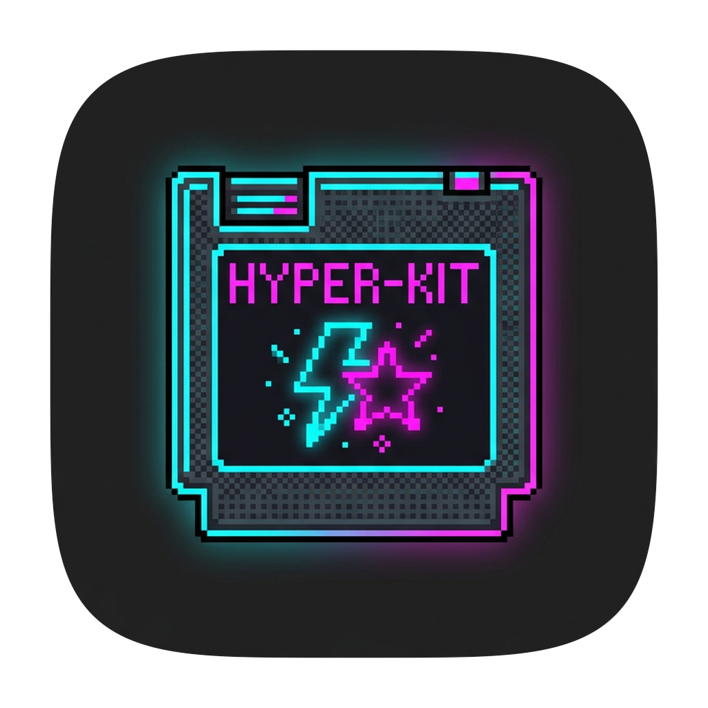

<p align="center">
  
</p>

<h1 align="center">🎮 HYPER-KIT 🕹️</h1>
<p align="center">
  <b>[ INSERT COIN TO PLAY ] — THE ALL-IN-ONE POWER-UP CARTRIDGE FOR HYPER TERMINAL</b>
</p>

<p align="center">
  <code>HIGH SCORE: 999990</code> • <code>LIVES: ❤ ❤ ❤</code> • <code>STAGE: 1-1</code> • <code>VER: 0.0.1</code>
</p>

---

## 🕹️ GAME OVERVIEW

**HYPER-KIT** is a legendary retro-charged power-up cartridge for [Hyper Terminal](https://hyper.is/). Instead of juggling a dozen separate plugins, you get **one cartridge** loaded with the most useful Hyper upgrades — vertical 8-bit side-scrolling HUD tab bar, random per-tab neon accent colors, command status badges, live PWD map tracking, drag & drop reorder, toolchain inventory panel, and a deep-dark backdrop.

Every power-up is part of **one cartridge toggle in the config spellbook** — flip a single switch to power the whole kit on or off without uninstalling anything. One kit, your rules.

---

## ⚡ POWER-UPS & SPECIAL MOVES (FEATURES)

- 📜 **Dual-Row HUD Display**:
  - **Row 1 (Quest Title)**: Displays the terminal title, as sent by your shell (e.g. agent/window titles via OSC 0/2) and rendered by Hyper natively.
  - **Row 2 (World Map)**: Shows your active directory path (`pwd`), tracked by the plugin.
- 📍 **Live Radar Tracking (OSC 7)**: Real-time map updates as you teleport across directories (`cd`).
- ⏱️ **Command Status Badges**:
  - **Charging Move**: Background tabs running tasks feature an animated spinner.
  - **Stage Cleared**: Displays a green checkmark when commands finish (clears on tab focus).
- 📐 **Resizable Side-Dock**: Left-aligned vertical bar (240px default), adjustable from 120px to 420px via right drag handle. Width persists across game reboots!
- 🖱️ **Drag & Drop Reorder**: Grab any tab and drag it up or down — a ghost follows your cursor with a neon insert line showing the drop slot. `Esc` cancels.
- 🎨 **10-Color Neon Palette**: Random neon accent color assigned to every tab; the active tab gets a highlighted border and bright text.
- 💎 **Frosted-Glass Armor FX**: Translucent glass aesthetic, smoothed morph transitions, custom mini scrollbar, and bottom edge fade.
- 💨 **Fluid Motion & Accessibility**: Press feedback (`:active` scale), hover slides, and spring curves. Fully honors `prefers-reduced-motion` & `prefers-reduced-transparency`.
- 🕹️ **Solo Player Mode**: Single-tab sessions receive a sleek pill HUD + auto terminal keyboard focus on launch.
- 🧰 **Inventory & Stats Panel**: Bottom bar auto-probes 88 developer tools, coding agents, runtimes, and languages!
- 🌙 **Deep Dark Backdrop**: Forces a dark terminal background (`#141414`), border color, and JetBrainsMono font while leaving your ANSI prompt & shell color themes intact. This is a backdrop, not a full color theme.

---

## 🎚️ TOGGLE THE CARTRIDGE

The vertical-tab cartridge has one master switch in `~/.hyper.js`. Each power-up also keeps its own switch — set `verticalTab` to `false` to power the whole kit down, or flip just one, like `dragDropTabs`:

```js
module.exports = {
  config: {
    hyperKit: {
      verticalTab: true,     // 📜 Vertical tab bar with dual-row HUD (master switch)
      dragDropTabs: true,    // 🖱️ Drag & drop tab reorder
    },
  },
};
```

---

## 💾 INSTALLATION (QUEST SETUP)

Follow these 4 stages to equip the `hyper-kit` cartridge into your Hyper loadout.

### ✅ PREREQUISITES

- **Hyper Terminal 3.x** — installed and working
- **Node.js 18+** and **npm** — required to build the plugin (`node -v` to check)

---

### 🚩 STAGE 1: SUMMON CODE TO LOCAL PLUGINS DOCK

Clone into Hyper's local plugin vault:

```sh
git clone https://github.com/jonaskahn/hyper-kit.git ~/.hyper_plugins/local/hyper-kit
cd ~/.hyper_plugins/local/hyper-kit
```

_Or, if you already have the code locally, copy it into place instead of cloning — the result is identical as long as the folder lives at `~/.hyper_plugins/local/hyper-kit` with a `package.json` inside it._

> 💡 _Already developing inside this repository? Jump straight to Stage 2!_

### 🔨 STAGE 2: CRAFT & BUILD THE CARTRIDGE

**This stage is required — the plugin won't load until the build completes:**

```sh
npm install
npm run build   # Compiles TypeScript -> dist/index.js
```

You should now see a `dist/` folder containing `index.js` in the plugin directory. If it's missing, the build failed — fix any npm errors and re-run.

### ⚙️ STAGE 3: EQUIP IN CONFIG SPELLBOOK

Open `~/.hyper.js` (create it from the **Edit → Preferences** menu if you don't have one) and add `hyper-kit` to your `localPlugins` array:

```js
module.exports = {
  config: {
    // ... your existing config
  },
  localPlugins: ['hyper-kit'],
};
```

> ⚠️ If `localPlugins` already exists, just add `'hyper-kit'` to the array — don't overwrite other entries.

### 🚀 STAGE 4: RESTART GAME ENGINE

1. Quit Hyper completely (`Cmd + Q`)
2. Relaunch Hyper

**Verify it worked:** a vertical tab bar with a neon glow should appear on the **left side** of the window. Not seeing it? See [TROUBLESHOOTING](#%EF%B8%8F-troubleshooting) below.

_Pro-Tip for developers:_ Rebuild with `npm run build` and hit **View → Full Reload** (`Cmd + Alt + R`) to apply live edits without a full restart.

---

### 🛠️ TROUBLESHOOTING

| Symptom                               | Fix                                                                 |
| :------------------------------------ | :------------------------------------------------------------------ |
| Tab bar doesn't appear                | Run `npm install && npm run build` in `~/.hyper_plugins/local/hyper-kit`, then quit & relaunch Hyper |
| `localPlugins` not being picked up    | Make sure the plugin folder is named exactly `hyper-kit` (matching the array entry) |
| Plugin loads but looks broken/stale   | Fully quit Hyper (`Cmd + Q`) — config changes don't hot-reload       |
| `npm run build` errors                | Verify Node 18+ (`node -v`) and delete `node_modules` + `dist`, then re-install |

---

## 🕹️ DEVELOPER CONTROLS & COMMANDS

Enter these commands in your console terminal to run maintenance spells:

| Command             | Action / Spell                                                    |
| :------------------ | :---------------------------------------------------------------- |
| `npm run build`     | 🔨 Craft TypeScript source into `dist/` CommonJS output           |
| `npm run test`      | ⚔️ Launch Vitest suite (83/83 test bosses in jsdom)               || `npm run typecheck` | 🔮 Scan spellbook for type errors (`tsc --noEmit`)                |
| `npm run lint`      | 🧹 Purge code bugs with ESLint                                    |
| `npm run format`    | 🧼 Polish code armor using Prettier                               |
| `npm run check`     | 🏆 Run full test suite, lint, format, and typecheck in one combo! |

---

## 👾 SYSTEM CARTRIDGE REQUIREMENTS

- **Hyper Engine**: Version 3.x (macOS, Windows, or Linux)
- **Mana Source**: Node.js 18+ and `npm` (required for building)
- **Recommended Font**: `JetBrainsMono Nerd Font` (falls back gracefully to `Menlo`)

---

## ⚙️ GAME OPTIONS & TUNING KNOBS

### 🎛️ Hardcoded Config Knobs

Edit `src/config.ts` or `src/platform/tool-probe.ts` to tweak your game HUD parameters:

| Knob               | Location                                      | Default Value    | Description                  |
| :----------------- | :--------------------------------------------- | :--------------- | :--------------------------- |
| **Tab Bar Width**  | `DEFAULT_WIDTH` (`src/config.ts`)              | `240`            | Initial HUD bar width (px)   |
| **Width Clamp**    | `MIN_WIDTH` / `MAX_WIDTH`                      | `120` / `420`    | Min & Max drag boundaries    |
| **Color Palette**  | `INDICATOR_COLORS` (`src/features/tabs.ts`)    | 10 Neon Colors   | Random tab accent colors     |
| **Font Family**    | `FONT_FAMILY` (`src/config.ts`)                | JetBrainsMono    | Primary HUD font             |
| **HUD Background** | `CSS` in `src/platform/style-injector.ts`      | Translucent Dark | CSS rules & glass armor FX   |
| **Detected Tools** | `ENV_TOOLS` (`src/platform/tool-probe.ts`)     | 88 Items         | Probe database for inventory |

### 🧰 Inventory Panel Configuration (`tabUi` in `~/.hyper.js`)

Customize your Inventory HUD in `~/.hyper.js` to prioritize your favorite equipment:

```js
module.exports = {
  config: {
    tabUi: {
      maxAgents: 10, // Max entries in the Agents row
      maxLanguages: 10, // Max entries in the Language row
      maxTools: 10, // Max entries in the Tool row
      maxRuntimes: 10, // Max entries in the Runtime row

      // Priority Order: Listed items appear first, followed alphabetically up to cap
      agentOrder: ['Claude', 'Codex', 'OpenCode', 'Gemini', 'Copilot'],
      languageOrder: ['Node', 'Go', 'Python', 'Rust', 'TypeScript'],
      toolOrder: ['Git', 'Docker', 'Bun', 'Deno'],
      runtimeOrder: ['Volta', 'Fnm', 'Asdf'],
    },
  },
};
```

---

## 📜 LIVE PWD SPELLS (OSC 7 SETUP)

Enable continuous map updates in your shell by embedding an OSC 7 escape sequence hook!

### 🧙 Zsh (macOS Default — `~/.zshrc`)

```sh
precmd() { printf '\e]7;file://%s%s\a' "$HOSTNAME" "${PWD// /%20}" }
```

### 🧙 Bash (Linux/Windows — `~/.bashrc`)

```sh
PROMPT_COMMAND='printf "\e]7;file://%s%s\a" "$HOSTNAME" "${PWD// /%20}"'
```

### 🧙 PowerShell (Windows — `$PROFILE`)

```powershell
function global:Set-Osc7 { $p = $PWD.Path -replace ' ', '%20'; Write-Host "`e]7;file://$env:COMPUTERNAME$p`a" -NoNewline }
Microsoft.PowerShell.Utility\Set-Alias cd -Value Set-Osc7 -Force
```

### 🧙 Git Bash (Windows — `~/.bashrc`)

```sh
PROMPT_COMMAND='printf "\e]7;file://%s%s\a" "$HOSTNAME" "${PWD// /%20}"'
```

> 💡 **Windows path radar**: hyper-kit normalizes Git Bash MSYS paths (`/c/Users/...`), cmd backslashes, and mixed drive-letter casing automatically, so `~` shortening and the PWD row work the same on every shell. Status badges need OSC 7 — without one of the snippets above, the spinner/checkmark stays dormant.

---

## 🗺️ GAME MAP & FILE STRUCTURE

Source is organized in layers — `core` (pure logic) → `platform` (host adapters) → `features` (user-visible capability) → `index.ts` (composition root). See [CONVENTION.md](./CONVENTION.md) for the full dependency rule and where to add new code.

```
hyper-kit/
├── logo.png                  # 🖼️ 8-Bit Retro Game Logo
├── src/                      # 🔮 TypeScript Source Code
│   ├── index.ts              # 🎮 Plugin Entry Point & Hyper Decorators (composition root)
│   ├── config.ts             # ⚙️ Settings, Defaults, Width Clamps & Feature Toggles
│   ├── types.ts              # 📦 Shared Hyper API Type Definitions
│   ├── core/                 # 🧩 Pure, host-agnostic logic (no DOM/Node/Hyper store)
│   │   ├── keyed-store.ts    #    Generic keyed-map store factory
│   │   ├── reorder.ts        #    reduceTermGroups reducer + drag-index math
│   │   └── session.ts        #    OSC 7 parsing & cwd formatting
│   ├── platform/              # 🔌 Thin wrappers around one host capability each
│   │   ├── hyper-store.ts     #    Hyper Redux store accessor + selector
│   │   ├── event-bus.ts       #    Typed CustomEvent pub/sub
│   │   ├── dom-selectors.ts   #    Hyper's DOM contract, centralized
│   │   ├── style-injector.ts  #    Injected CSS & Retro Aesthetics
│   │   ├── width-storage.ts   #    localStorage width persistence
│   │   ├── tool-probe.ts      #    Toolchain Detection (child_process)
│   │   └── state/             #    Small, encapsulated cross-feature stores
│   │       ├── tab-session-store.ts  # cwd / status / session-start maps
│   │       └── active-tab.ts         # Active Tab Tracking
│   └── features/verticalTabs/ # 🕹️ One file per user-visible capability
│       ├── session-tracking.ts #    Status heuristics & stale-session pruning
│       ├── env-panel.ts        #    Toolchain Inventory Panel
│       ├── drag-drop-tabs.ts  #    Drag & Drop Reorder Controller
│       ├── tabs.ts             #    Indicator Colors & Status Badges
│       └── tabbar.ts           #    Resize Handle & Single-Tab Logic
├── test/                     # ⚔️ Vitest Test Suite & Fixtures (mirrors src/)
├── dist/                     # 📦 Compiled CommonJS Output (Generated)
├── CONVENTION.md             # 📖 Clean-code & architecture conventions
└── package.json              # 📑 Project Manifest & Quest Scripts
```

---

<p align="center">
  <b>PRESS [START] TO BEGIN YOUR TERMINAL QUEST! 🎮✨</b>
</p>
